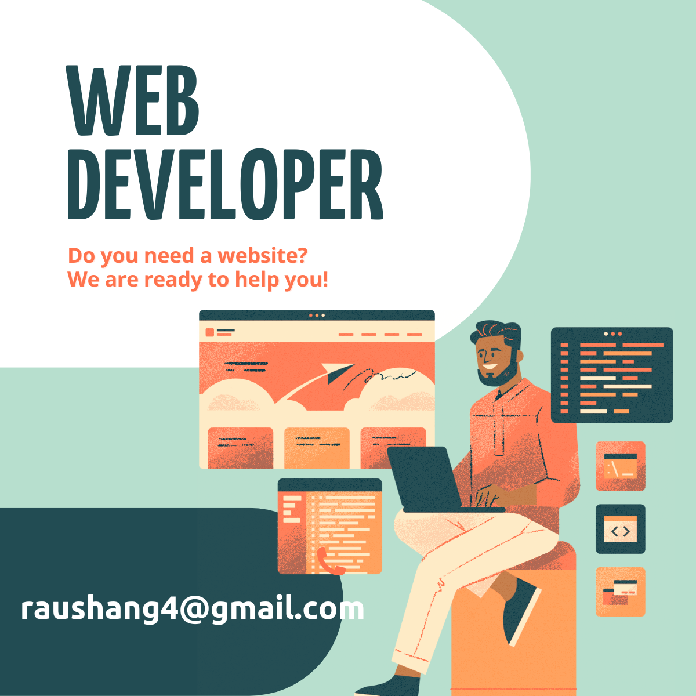

<!--   -->

<h1 align="center">🤖 Technical AI Automation Expert</h1>

  <b>Raushan Kumar</b> | AI Enthusiast | Automation Engineer | Full Stack Developer | DevOps Specialist

---

## 🎯 About Me

I am a **Technical AI Automation Expert** passionate about transforming business ideas into working solutions through **Artificial Intelligence, Automation, and Rapid Prototyping**. 

I specialize in:
- 🤖 **AI Implementation** - ChatGPT, Claude, Gemini API integrations
- ⚙️ **Workflow Automation** - n8n, Make.com, API-driven automations
- 🚀 **Rapid Prototyping** - Building proof-of-concepts and MVPs quickly
- 💼 **Business Automation** - Lead management, CRM, reporting systems
- 📊 **Internal Tools** - Dashboards, productivity systems, data management
- 🔧 **Full Stack Development** - MERN Stack, deployment, scalable solutions

I enjoy **identifying business problems, brainstorming solutions with stakeholders, and building practical solutions** that improve efficiency and reduce operational costs.

---

## 💡 Core Expertise

### 🤖 AI & LLM Technologies

    
    
    
    
    

### ⚙️ Automation & Workflow Platforms

    
    
    
    
    

### 💻 Programming Languages & Frameworks

    
    
    
    
    
    

### 🗄️ Databases & Backend

    
    
    

### 📊 Automation & Productivity Tools

    
    
    
    

### 🚀 Deployment & DevOps

    
    
    
    

### 🎨 Design & Prototyping

    
    

---

## 🚀 Key Projects & Automations

### 🤖 AI-Powered Projects
- **College ERP System** - Django-based automation for student management, attendance, and marks tracking
- **AI-Powered Precision Irrigation System** - Smart India Hackathon '23 project using ML for crop prediction
- **Automatic Irrigation & Crop Prediction** - Real-time sensor data processing with machine learning
- **ChatPDF** - PDF document intelligence tool using AI

### ⚙️ Automation & DevOps
- **DevOps Essential** - Automation, Cloud (AWS), Infrastructure as Code (Terraform/HCL)
- **Ansible Kitchen** - Configuration management and automation frameworks
- **n8n Workflow Automations** - Lead management, email/WhatsApp automations, CRM integrations

### 💼 Business Solutions
- **Agency Website** - Full-stack web application for business operations
- **Computer Distributor Portal** - E-commerce & inventory management system
- **College Website (Next.js)** - Modern web solution with responsive design
- **Acode Plugin (AcodeX)** - Terminal integration plugin for mobile development

### 🛠️ Internal Tools & Utilities
- **Codespace Auth System** - Authentication framework built in GitHub Codespaces
- **Spreadsheet Automations** - Excel/Google Sheets data processing and reporting
- **Dashboard Systems** - Real-time analytics and monitoring tools

---

## 📈 GitHub Analytics

<table>
  <tr>
    <td></td>
    <td></td>
  </tr>
</table>

  

---

## 📊 Contribution Activity

---

## 💬 Specializations

### 🎯 What I Do Best
✅ **Rapid Prototyping** - From idea to working solution in days, not months  
✅ **AI Integration** - Embedding ChatGPT, Claude, Gemini into business workflows  
✅ **Workflow Automation** - Eliminating manual repetitive tasks  
✅ **API Development** - Building and integrating REST/GraphQL APIs  
✅ **Cost Optimization** - Selecting efficient AI models and reducing API costs  
✅ **Problem Solving** - Converting business challenges into technical solutions  
✅ **Independent Learning** - Quickly adapting to new AI tools and platforms  

### 🤝 I'm Looking For
- Opportunities to build **AI-driven business solutions**
- Roles focused on **automation and rapid prototyping**
- Teams experimenting with **emerging AI technologies**
- Positions that value **execution over endless planning**
- Founder/leadership exposure and **hands-on technical work**

---

## 🌟 Why Work With Me

🚀 **Speed & Execution** - I prioritize validation and working solutions over perfection  
🧠 **AI-First Thinking** - I actively research and implement latest AI tools and models  
🔄 **Continuous Learning** - I stay updated with emerging technologies like Cursor, Windsurf, Replit  
💡 **Creative Problem Solving** - I think beyond traditional software development  
🤖 **Automation Mindset** - I identify opportunities to automate business processes  
⚡ **Full Stack Capability** - I can build end-to-end solutions independently  
🎯 **Business-Focused** - I understand that technology should solve real business problems  

---

## 📬 Connect With Me

  
  
  

---

## 🎓 Continuous Learning

I actively experiment with and stay updated on:
- **AI Platforms**: OpenAI, Anthropic (Claude), Google (Gemini), xAI (Grok), Perplexity
- **AI Dev Tools**: Cursor, Windsurf, Replit, Lovable, Bolt
- **Automation**: n8n, Make.com, Zapier
- **Web3 & Emerging Tech**: Exploring new possibilities for business automation

---

## 💡 "Ideas into Reality"

> My passion is converting business ideas into working prototypes as quickly as possible.  
> Speed + Experimentation + Execution = Innovation

**Let's build something amazing together! 🚀**

---

  <i>Open to new opportunities in AI, Automation, and Rapid Prototyping</i>

